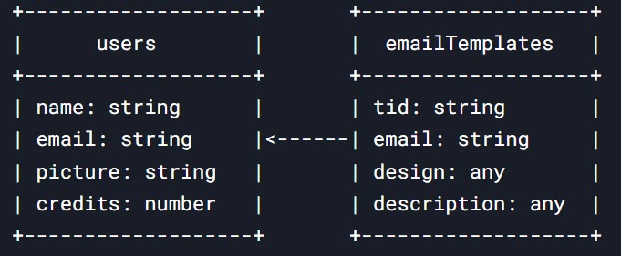

# AI Email Template Generator

## Overview

AI Email Template Generator is a fully equipped SaaS application built using advanced technologies: 
* Next.js for frontend, 
* Tailwind CSS for styles, 
* Convex for database,
* Google Identity Services,
* Google Generative AI to generate artificial intelligence 


[Site](https://ai-email-template-sxidsvit.vercel.app/)

## Target Audience

Individuals interested in developing artificial intelligence applications.

---

 

---


## Tech Stack

**Frontend (Client-Side):**

* **Next.js 15:** Provides a robust and performant foundation for the user interface.

* **Tailwind CSS & Shadcn UI:** Enables the creation of a visually appealing and responsive user interface.

* **Convex:** Package includes several entry points for building apps on Convex.

* **@react-oauth/google:** The new Google Identity Services SDK for React.

* **@google/generative-ai:** The Google AI JavaScript SDK is the easiest way for JavaScript developers to build with the Gemini API..


**Backend (Server-Side):**

* **Convex** Open-source reactive database for web app developers 


 

---
<br />

 *Configuration: Make sure to create a `.env` file with following variables*

```js

CONVEX_DEPLOYMENT=

NEXT_PUBLIC_CONVEX_URL=

NEXT_PUBLIC_GOOGLE_CLIENT_ID=

NEXT_PUBLIC_GEMINI_API_KEY=

CONVEX_DEPLOY_KEY=

```

## Getting Started

1. Visit the AI Email Template Generator website: [Site]( https://ai-email-template-sxidsvit.vercel.app/)
2. Create an account using the secure sign-up process.
3. Explore the platform's features and functionalities.


## Contact:

[][linkedin]

[linkedin]: https://www.linkedin.com/in/sergiy-antonyuk/

---

##### Acknowledgements

*A special thanks to [you](https://www.youtube.com/@tubeguruji) for your invaluable contributions and inspiration.*
